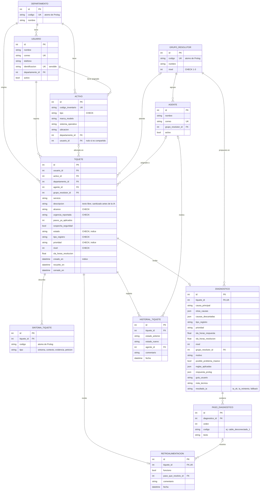

# Esquema de la base de datos

El diccionario de datos completo se agrega en la fase de documentacion.

## Diagrama entidad-relacion

```mermaid
erDiagram
    DEPARTAMENTO ||--o{ USUARIO : "tiene"
    DEPARTAMENTO ||--o{ ACTIVO : "tiene"
    DEPARTAMENTO ||--o{ TIQUETE : "origina"
    USUARIO ||--o{ ACTIVO : "tiene asignado"
    USUARIO ||--o{ TIQUETE : "reporta"
    ACTIVO |o--o{ TIQUETE : "afectado en"
    GRUPO_RESOLUTOR ||--o{ AGENTE : "agrupa"
    GRUPO_RESOLUTOR |o--o{ TIQUETE : "atiende"
    AGENTE |o--o{ TIQUETE : "asignado a"
    TIQUETE ||--o{ SINTOMA_TIQUETE : "describe"
    TIQUETE ||--o| DIAGNOSTICO : "recibe"
    GRUPO_RESOLUTOR ||--o{ DIAGNOSTICO : "propuesto en"
    DIAGNOSTICO ||--o{ PASO_DIAGNOSTICO : "contiene"
    TIQUETE ||--o{ HISTORIAL_TIQUETE : "registra"
    AGENTE |o--o{ HISTORIAL_TIQUETE : "realiza"
    TIQUETE ||--o| RETROALIMENTACION : "recibe"
    PASO_DIAGNOSTICO |o--o{ RETROALIMENTACION : "resolvio"

    DEPARTAMENTO {
        int id PK
        string codigo UK "atomo de Prolog"
        string nombre
    }
    GRUPO_RESOLUTOR {
        int id PK
        string codigo UK "atomo de Prolog"
        string nombre
        int nivel "CHECK 1-3"
    }
    USUARIO {
        int id PK
        string nombre
        string correo UK
        string telefono
        string identificacion UK "sensible"
        int departamento_id FK
        bool activo
    }
    AGENTE {
        int id PK
        string nombre
        string correo UK
        int grupo_resolutor_id FK
        bool activo
    }
    ACTIVO {
        int id PK
        string codigo_inventario UK
        string tipo "CHECK"
        string marca_modelo
        string sistema_operativo
        string ubicacion
        int departamento_id FK
        int usuario_id FK "nulo si es compartido"
    }
    TIQUETE {
        int id PK
        int usuario_id FK
        int activo_id FK
        int departamento_id FK
        int agente_id FK
        int grupo_resolutor_id FK
        string servicio
        string descripcion "texto libre, sanitizado antes de la IA"
        string alcance "CHECK"
        string urgencia_reportada "CHECK"
        int pasos_ya_aplicados
        bool sospecha_seguridad
        string estado "CHECK, indice"
        string tipo_registro "CHECK"
        string prioridad "CHECK, indice"
        int nivel "CHECK"
        float sla_horas_resolucion
        datetime creado_en "indice"
        datetime resuelto_en
        datetime cerrado_en
    }
    SINTOMA_TIQUETE {
        int id PK
        int tiquete_id FK
        string codigo "atomo de Prolog"
        string tipo "sintoma, contexto, evidencia, peticion"
    }
    DIAGNOSTICO {
        int id PK
        int tiquete_id FK,UK
        string causa_principal
        json otras_causas
        json causas_descartadas
        string tipo_registro
        string prioridad
        float sla_horas_respuesta
        float sla_horas_resolucion
        int nivel
        int grupo_resolutor_id FK
        string motivo
        bool posible_problema_masivo
        json reglas_aplicadas
        json respuesta_prolog
        string guia_usuario
        string nota_tecnica
        string resultado_ia "ia_ok, ia_reintento, fallback"
    }
    PASO_DIAGNOSTICO {
        int id PK
        int diagnostico_id FK
        int orden
        string codigo "ej. cable_desconectado_1"
        string texto
    }
    HISTORIAL_TIQUETE {
        int id PK
        int tiquete_id FK
        string estado_anterior
        string estado_nuevo
        int agente_id FK
        string comentario
        datetime fecha
    }
    RETROALIMENTACION {
        int id PK
        int tiquete_id FK,UK
        bool funciono
        int paso_que_resolvio_id FK
        string comentario
        datetime fecha
    }
```
